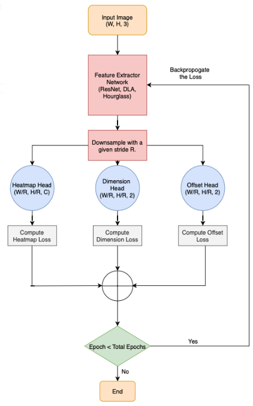

# CenterNet 
Pytorch implementation of CenterNet architecture introduced in this [paper](https://arxiv.org/abs/1904.07850).


## Introduction
Detection identifies objects as axis-aligned boxes in an image. Most successful object detectors enumerate a nearly exhaustive list of potential object locations and classify each. This is wasteful, inefficient, and requires additional post-processing. In this [paper](https://arxiv.org/abs/1904.07850), Zhou et al. take a different approach. They model an object as a single point -- the center point of its bounding box. Their detector uses keypoint estimation to find center points and regresses to all other object properties, such as size, 3D location, orientation, and even pose. The center point based approach, CenterNet, is end-to-end differentiable, simpler, faster, and more accurate than corresponding bounding box based detectors. 




## Requirements

```
torch >= 1.2.0  
torchvision>=0.4.1  
timm >= 0.1.14
Pillow >= 6.2.2
opencv-python >= 4.2.0
albumentations >= 0.4.5
easydict >= 1.9
```

## Project Structure
This repository was organized as follows:
```
.
├─ dataset/
│  ├─ params.py              <- VOC dataset parameters
│  ├─ transform.py           <- For data augmentation
│  ├─ utils.py               <- utility functions and classes
│  └─ voc.py                 <- Read and load VOC dataset
├─ model/                    
│  ├─ backbone/              
│  │  └─ renset.py           <- Backbone architecture
│  ├─ head.py
│  ├─ fpn.py
│  ├─ decoder.py
│  └─ centernet.py           <- Define CenterNet model
├─ losses/
│  ├─ utils.py               <- utils functions to compute losses
│  ├─ losses.py              <- Define different loss functions
│  └─ loss_func.py           <- Complete loss function
├─ trainer/
│  ├─ lr_scheduler.py        <- learning rate adjustement
│  └─ trainer.py             <- Class for training model
├─ images/                   <- Images for network explanation
│  ├─ CenterNet_bbox.png
│  ├─ CenterNet_flowchart.png
│  └─ CenterNet_architecture.png
├─ test.py                   <- Testing the model from a given checkpoint
├─ main.py                   <- Train the complete model on VOC dataset
└─ README.md
```

## Usage
First, you need to download VOC dataset and then modify dataset root parameter in params.py file.
After specifying the different setting parameters, you can start your training using the following script:
```
python3 main.py
```

## Acknowledgement
Thanks to the implementation done by [gakkiri](https://github.com/gakkiri/simple-centernet-pytorch).
