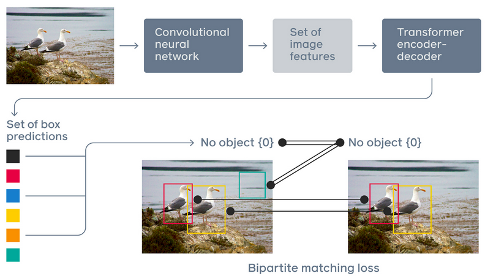
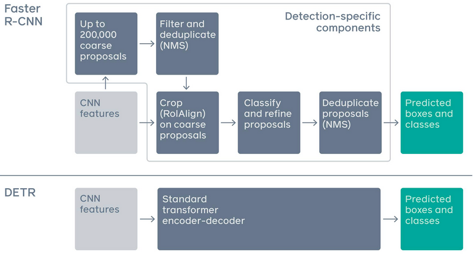
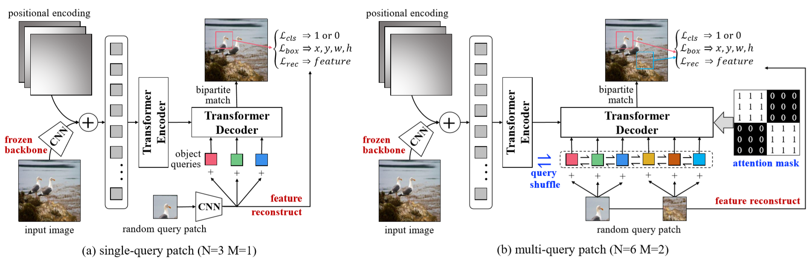

# Detection Transformer (DETR)
Pytorch implementation of Transformer-based object detection architecture introduced by [Carion et al.](https://arxiv.org/abs/2005.12872)





## Requirements
The experiments were performed using Python 3.8.5 with the following Python packages:
- [numpy](http://www.numpy.org/)
- [torch](https://pytorch.org/)
- [torchvision](https://pypi.org/project/torchvision/)
- [matplotlib](https://pypi.org/project/matplotlib/)
- [scipy](https://pypi.org/project/scipy/)
- [pillow](https://pypi.org/project/Pillow/)
- [pathlib](https://pypi.org/project/pathlib/)
- [datatime](https://pypi.org/project/DateTime/)
- [pycocotools](https://pypi.org/project/pycocotools/)

## Data preparation
Download and extract COCO 2017 train and val images with annotations from its original [website](http://cocodataset.org). We expect the directory structure to be the following:
```
path/to/coco/
  annotations/  # annotation json files
  train2017/    # train images
  val2017/      # val images
```

## Usage
First, you need to download COCO dataset and then modify dataset root parameter in main.py file.
After specifying the different arguments, you can start your training using the following script:
```
python3 main.py [--coco_path COCO_PATH] [--remove_difficult]
                [--output_dir OUTPUT_DIR] [--device DEVICE] [--seed SEED] [--resume RESUME]
                [--start_epoch N] [--num_workers NUM_WORKERS] [--world_size WORLD_SIZE]
                [--lr LR] [--lr_backbone LR_BACKBONE] [--batch_size BATCH_SIZE]
                [--weight_decay WEIGHT_DECAY] [--epochs EPOCHS] [--lr_drop LR_DROP]
                [--clip_max_norm CLIP_MAX_NORM] [--frozen_weights FROZEN_WEIGHTS]                 
```
In addition, we can simply test a DETR model on a single image and visualize results by running the following script:
```
python3 demo.py
```

## Unsupervised DETR (UP-DETR)
This repository includes an implementation of an improvement of DETR proposed by [Dai et al.](https://arxiv.org/abs/2011.09094)



In UP-DETR, they introduce a novel pretext named random query patch detection to pre-train transformers for object detection. UP-DETR inherits from DETR with the same ResNet-50 backbone, same Transformer encoder, decoder and same codebase. With unsupervised pre-training CNN, the whole UP-DETR pre-training doesn't require any human annotations.

## Acknowledgment
[facebook research](https://github.com/facebookresearch/detr)
[](https://github.com/towardsautonomy/DETR)
