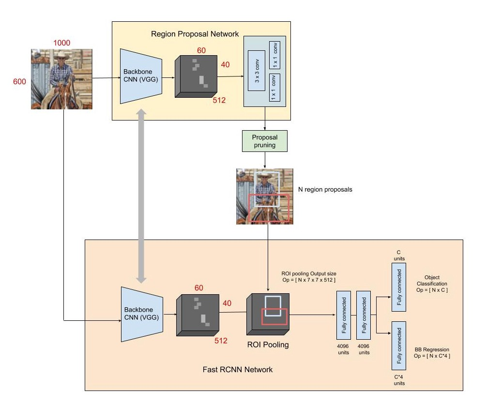

# Faster-RCNN
This is a pytorch implementation of Faster RCNN published by [Ren et al.](https://arxiv.org/abs/1506.01497).




## Requirements
The experiments were performed using Python 3.8.5 with the following Python packages:
- [numpy](http://www.numpy.org/)
- [torch](https://pytorch.org/)
- [torchvision](https://pypi.org/project/torchvision/)
- [matplotlib](https://pypi.org/project/matplotlib/)
- [chainercv](https://pypi.org/project/chainercv/)

## Training

This project uses the convenient api provided by chainercv to download and load the Pascal VOC2007 dataset, please install it before running the training script.

```
 python3 main.py
```

## Testing
You simply test the model starting from a checkpoint by the following script:
```
python3 demo.py
```


## Acknowledgement
Thanks to the implementation done [here](https://github.com/wllvcxz/faster-rcnn-pytorch).
