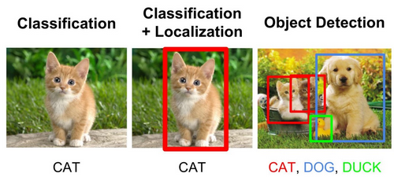

# Object-Detection-Algorithms
Pytorch implementation of seven state-of-the-art algorithms for object detection.


## Introduction
Object recognition is a general term to describe a collection of related computer vision tasks that involve identifying objects in digital photographs.

Image classification involves predicting the class of one object in an image. Object localization refers to identifying the location of one or more objects in an image and drawing abounding box around their extent. Object detection combines these two tasks and localizes and classifies one or more objects in an image.

As such, we can distinguish between these three computer vision tasks:

* **Image Classification:** Predict the type or class of an object in an image.
        - Input: An image with a single object, such as a photograph.
        - Output: A class label (e.g. one or more integers that are mapped to class labels).
* **Object Localization:** Locate the presence of objects in an image and indicate their location with a bounding box.
        - Input: An image with one or more objects, such as a photograph.
        - Output: One or more bounding boxes (e.g. defined by a point, width, and height).
* **Object Detection:** Locate the presence of objects with a bounding box and types or classes of the located objects in an image.
        - Input: An image with one or more objects, such as a photograph.
        - Output: One or more bounding boxes (e.g. defined by a point, width, and height), and a class label for each bounding box.




## Pascal VOC Dataset

For Pascal VOC dataset, make the folder structure like this:
```
VOC_ROOT
|__ VOC2007
    |_ JPEGImages
    |_ Annotations
    |_ ImageSets
    |_ SegmentationClass
|__ VOC2012
    |_ JPEGImages
    |_ Annotations
    |_ ImageSets
    |_ SegmentationClass
|__ ...
```
Where `VOC_ROOT` default is `datasets` folder in current project.


## Project Structure

```
.
├─ datasets/
│  ├─ VOC2007/               <- VOC2007 dataset folder
│  │  	└─...
│  ├─ VOC2012/               <- VOC2012 dataset folder
│  │  	└─...
│  ├─ VOC2007.sh             <- script to download VOC2007 dataset
│  └─ VOC2012.sh             <- script to download VOC2012 dataset
│
├─ CenterNet/                <- Implementation of CenterNet
│  └─ ...
├─ DETR/                     <- Implementation of DEtection TRansformer (DETR)
│  └─ ...
├─ Faster-RCNN/              <- Implementation of Faster-RCNN
│  └─ ...
├─ SSD/                      <- Implementation of Single Shot Detector (SSD)
│  └─ ...
├─ Yolo-v1/                  <- Implementation of YOLO-v1
│  └─ ...
├─ Yolo-v2/                  <- Implementation of YOLO-v2
│  └─ ...
├─ Yolo-v3/                  <- Implementation of YOLO-v3
│  └─ ...
│
└─ README.md
```

## References
1. [Faster R-CNN: Towards Real-Time Object Detection with Region Proposal Networks](https://arxiv.org/abs/1506.01497)
2. [SSD: Single Shot MultiBox Detector](https://arxiv.org/abs/1512.02325)
3. [You Only Look Once: Unified, Real-Time Object Detection](https://arxiv.org/abs/1506.02640) 
4. [YOLO9000: Better, Faster, Stronger](https://arxiv.org/abs/1612.08242)
5. [YOLOv3: An Incremental Improvement](https://arxiv.org/abs/1804.02767)
6. [Objects as Points](https://arxiv.org/abs/1904.07850)
7. [End-to-End Object Detection with Transformers](https://arxiv.org/abs/2005.12872)
8. [UP-DETR: Unsupervised Pre-training for Object Detection with Transformers](https://arxiv.org/abs/2011.09094)
