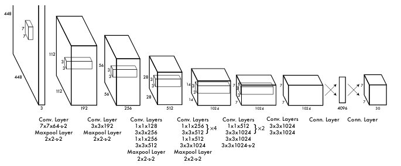

# YOLO Implementation
This part includes the Pytorch implementation of YOLO-v1 architecture for object detection publised by [Redmon et al.](https://arxiv.org/pdf/1506.02640.pdf).



## Introduction
YOLO stands for You Only Look Once. As the name says, network only looks the image once to detect multiple objects. The main improvement on this paper is the detection speed (~45 fps).
YOLO is different from all these methods as it treats the problem of image detection as a regression problem rather than a classification problem and supports a single convolutional neural network to perform all the above mentioned tasks.
There are 5 versions of YOLO namely version 1, version 2, version 3, version 4 and version 5. This part covers the first version.


## Requirements
The experiments were performed using Python 3.8.5 with the following Python packages:
- [numpy](http://www.numpy.org/)
- [torch](https://pytorch.org/)
- [torchvision](https://pypi.org/project/torchvision/)
- [matplotlib](https://pypi.org/project/matplotlib/)
- [pillow](https://pypi.org/project/Pillow/)
- [imgaug](https://pypi.org/project/imgaug/)

## Organization
This repository was organized as follows:
```
.
├─ dataset/
│  ├─ data_augmentation.py   <- For data augmentation (tranformations)
│  └─ dataloader.py          <- Read and load VOC dataset
├─ utils/                    
│  ├─ helpers.py             <- utility functions and classes
│  ├─ summary.py             <- Summary of the network and its parameters
│  └─ visualize.py           <- Results visualization
├─ convert_yolo.py           
├─ loss.py                   <- defining the loss function
├─ model.py                  <- main model architecture
├─ test.py                   <- Testing the model from a given checkpoint
├─ train.py                  <- Train function
├─ main.py                   <- main file to train the whole model on VOC dataset
├─ yolov1_architecture.png
└─ README.md
```


## Training And Testing
To begin with, you have to specify the different parameters needed for the training as shown in the table below:

|argument          |type|description|default|
|:-----------------|:----|:---------------------- |:----|
|--mode            |str  |train or test           |train|
|--data_path       |str  |data path               |./   |
|--input_height    |int  |input height            |448  |
|--input_width     |int  |input width             |448  |
|--batch_size      |int  |batch size              |16   |
|--num_epochs      |int  |number of epochs        |16000|
|--learning_rate   |float|initial learning rate   |1e-3 |
|--dropout         |float|dropout probability     |0.5  |
|--checkpoint_path |str  |checkpoint path         |./   |
|--use_augmentation|bool |image Augmentation      |True |
|--use_visdom      |bool |visdom                  |False|
|--use_summary     |bool |descripte Model summary |True |
|--check_gt        |bool |ground truth check flag |False|
|--cuda            |bool |set device:CPU/GPU      |False|
|--step_display    |int  |print training status   |200  |

Next step is to download your dataset and change the path directory. And then enjoy your training by running the main.py file.

You can test your training results simply by changing the mode parameter to 'test'.

## Acknowledgment
Thanks to the implementation done by [ssaru](https://github.com/ssaru/You_Only_Look_Once).
